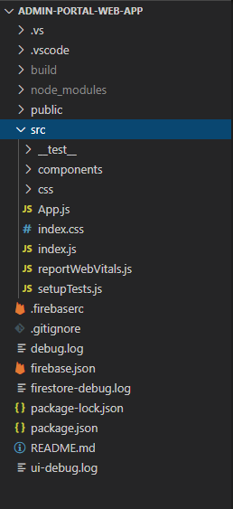

# Deployment Manual

- This documentation is used to explain how to deploy and maintain a running system of our project

## Folder Structure

## Installing Prerequisites

- Install Node (v14.15.1 is tested)
  - https://nodejs.org/en/download/
  - Test that Node and Node Package Manager (npm) commands are available via command line
  - For more help: https://nodejs.dev/learn/how-to-install-nodejs 
- Install Git
  - https://git-scm.com/downloads 
  - Test that Git commands are available via command line

## Clone Repos

- Clone this repository first via the command below:
  - git clone https://github.com/shadopawn/admin-portal-web-app.git

 ## Install Required Packages

- Open a terminal and navigate to the admin-portal-web-app folder that was just cloned
- run the command “npm install”. This should install all packages from the package.json file that is stored in the admin-portal-web-app folder

## Starting Admin Portal Application

- Open a terminal and navigate to the admin-portal-web-app folder that was cloned
- To start a locally hosted build of the application, run the command “npm run start”

## Build Deployment to Github pages site

- Open a terminal and navigate to the admin-portal-web-app folder that was cloned
- To build the application to our github pages site, run the command “npm run deploy”
