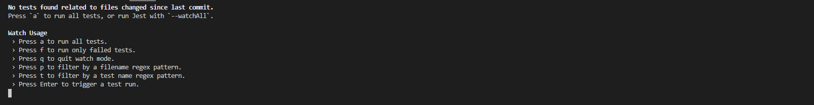
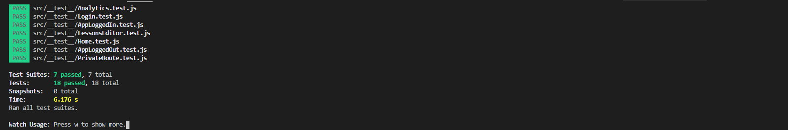

# Development Environment Manual Admin Portal

- This documentation is used to explain how to replicate a development environment of our project

## Technology Stack
### Admin Portal
- React - https://www.reactjs.org/ - Web Application framework and a JavaScript library for building user interfaces. What the application is built on. 
- Firebase - https://firebase.google.com/ - Firebase is a cloud computing solution with competitive pricing for applications without much data or many read/writes. The database and storage used to house the application data. 
- Node - https://nodejs.org/en/ - As an asynchronous event-driven JavaScript runtime, Node.js is designed to build scalable network applications. Used to manage the servers and packages.
- Text Editor/Terminal - https://code.visualstudio.com/ - Any text editor and terminal can work with this project. We recommend you use whatever you are comfortable with. We used VSCode and its built in terminal.
### RefReps Application
- Unity - https://unity.com/ - A game development engine used to create the functional RefReps application
- Firebase - https://firebase.google.com/ - Firebase is a cloud computing solution with competitive pricing for applications without much data or many read/writes. The database and storage used to house the application data. 

# Replicating Admin Portal Environment 
## Installing Prerequisites

- Install Node (v14.15.1 is tested)
  - https://nodejs.org/en/download/
  - Test that Node and Node Package Manager (npm) commands are available via command line
  - For more help: https://nodejs.dev/learn/how-to-install-nodejs 
- Install Git
  - https://git-scm.com/downloads 
  - Test that Git commands are available via command line

## Clone Repos

- Clone this repository first via the command below:
  - git clone https://github.com/shadopawn/admin-portal-web-app.git

 ## Install Required Packages

- Open a terminal and navigate to the admin-portal-web-app folder that was just cloned
- run the command “npm install”. This should install all packages from the package.json file that is stored in the admin-portal-web-app folder

#At this point, the development environment should be successfully created

## Starting Admin Portal Application

- Open a terminal and navigate to the admin-portal-web-app folder that was cloned
- To start a locally hosted build of the application, run the command “npm start”

## Testing Admin Portal Application

- Open a terminal and navigate to the admin-portal-web-app folder that was cloned
- To locally test a build of the application, run the command “npm test”
- This is what is likely to be shown if no new tests have been added. It may also immediately run all tests your first time running the command. If so, view the next section for interpretation. 

- If you want to run all the test, simply input "a"

## Interpreting test
- This is what it looks like to have every test pass

- When a test fails, it will change the green pass to a red fail. It will then describe the failure above

# Replicating RefReps Environment 

