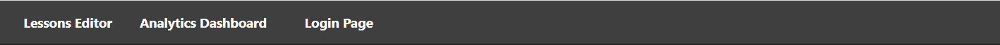
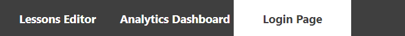
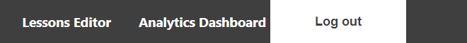
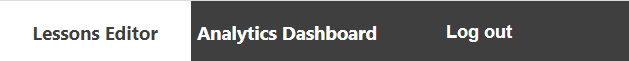

# Admin Portal User Manual
- This documentation is used to explain how a user would interact with the Admin Portal and the RefReps Application

## Navigation
- Use the navigation bar at the top of the application to view the different pages

- Click on “Lessons Editor” to be taken to the Editor where you will be able to build lessons
- Click on “Analytics Dashboard” to be taken to the dashboard where you'll view analytics 
- Click on “Login Page” to be taken to the page where you’ll be able to log in as an Admin

## Login
- Click on “Login Page”

- Once here, you’ll see an input field for both a username and password. Enter both your Admin username and respective password.
- Once you have the correct username and password input, click Log in to be taken to your previous page logged in as an Admin.

## Logout
- Ensure you are logged in as an Admin. To see how, view the Login section.
- You will noticed the navigation bar has changed the “Login Page” with a “Logout” link
- Click the “Logout” navigation to logout

## Uploading Videos
- Ensure you are logged in as an Admin. To see how, view the Login section.
- Click on “Lessons Editor” 

- You will be greeted with a progress bar and button name “Choose File”
- Click on the “Choose File” button when you are ready to upload
- You will be greeted with a file explorer for your browser
- Choose the file you want to upload
- The progress bar will upload and when it is at 100%, you have successfully uploaded the file

# RefReps User Manual
## Download Video
