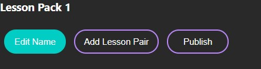
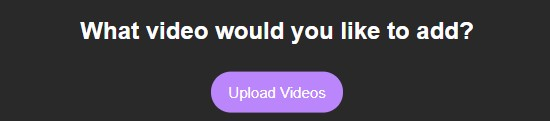
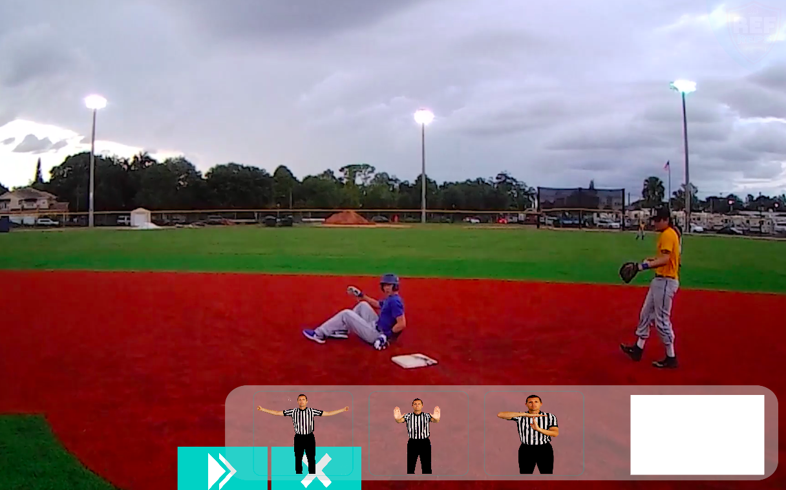

# Admin Portal User Manual
This documentation is used to explain how a user would interact with the Admin Portal and the RefReps Application

## Navigation
- Use the navigation bar at the top of the application to view the different pages

- Click on “Lessons Editor” to be taken to the Editor where you will be able to build lessons
- Click on “Analytics Dashboard” to be taken to the dashboard where you'll view analytics 
- Click on “Login Page” to be taken to the page where you’ll be able to log in as an Admin

## Login
- Click on “Login Page”

- Once here, you’ll see an input field for both a username and password. Enter both your Admin username and respective password.
- Once you have the correct username and password input, click Log in to be taken to your previous page logged in as an Admin.

## Logout
- Ensure you are logged in as an Admin. To see how, view the Login section.
- You will noticed the navigation bar has changed the “Login Page” with a “Logout” link
- Click the “Logout” navigation to logout

## Creating a new Lesson Pack
- Ensure you are logged in as an Admin. To see how, view the Login section.
- Click on “Lessons Editor”

- Click on “Create Lesson Pack”

- A new lesson pack will be added to the Lesson Pack List

## Editing a Lesson Pack: Changing the name
- Ensure you are logged in as an Admin. To see how, view the Login section.
- Click on “Lessons Editor”

- Click “Edit” next to the lesson pack you would like to change the name of

- Under the lesson pack name, click Edit name                                                 

- You will be greeted with a textbox, submit button, and close button
- Type in the new name                                                              

- Click submit
- You have successfully changed the name of a lesson pack

## Editing a Lesson Pack: Adding a lesson pair
- Ensure you are logged in as an Admin. To see how, view the Login section.
- Click on “Lessons Editor”

- Click “Edit” next to the lesson pack you would like to add a lesson pair to

- Under the lesson pack name, click “Add Lesson Pair”                                  

- You have successfully added a lesson pair

## Editing a Lesson Pack: Deleting a lesson pair
- Ensure you are logged in as an Admin. To see how, view the Login section.
- Click on “Lessons Editor”

- Click “Edit” next to the lesson pack you would like to delete a lesson pair from

- Next to the lesson pair you would like to delete, click “Delete”                       

- You have successfully deleted a lesson pair

## Editing a Lesson Pack: Selecting a lesson pair
- Ensure you are logged in as an Admin. To see how, view the Login section.
- Click on “Lessons Editor”

- Click “Edit” next to the lesson pack you would like to delete a lesson pair from

- Click on the lesson pair you would like to edit                     

- A new section will open up to the left, displaying the lesson pairs attributes

- You have successfully selected a lesson pair

## Editing a Lesson Pack: Chaning a Lesson Pair Name
- Ensure you are logged in as an Admin. To see how, view the Login section.
- Click on “Lessons Editor”

- Click “Edit” next to the lesson pack you would like to delete a lesson pair from

- Click on the lesson pair you would like to edit                     

- A new section will open up to the left, displaying the lesson pairs attributes

- Click on the Edit Name button next to the Lesson Pair name in the new section

- You have successfully changed a lesson pair name

## Editing a Lesson Pack: Adding a video to a lesson pair
- Ensure you are logged in as an Admin. To see how, view the Login section.
- Click on “Lessons Editor”

- Click “Edit” next to the lesson pack you would like to add/change a video for

- Click on the lesson pair you would like to edit                     

- A new section will open up to the left, displaying the lesson pairs attributes

- Click “Add video” next to the video you would like to add/change                           

- You will be greeted with all the videos uploaded to the database, see Uploading Videos for how to upload
- Click the video name you would like to add
- You have successfully added/changed a video

## Editing a Lesson Pack: Adding a call to a lesson pair
- Ensure you are logged in as an Admin. To see how, view the Login section.
- Click on “Lessons Editor”

- Click “Edit” next to the lesson pack you would like to add/change a call for

- Click on the lesson pair you would like to edit                     

- A new section will open up to the left, displaying the lesson pairs attributes

- Click “Add Call” next to the call you would like to add/change                          

- You will be greeted with many calls uploaded to the database
- Click the call name you would like to add
- You have successfully added/changed a call

## Publishing a Lesson Pack
- Ensure you are logged in as an Admin. To see how, view the Login section.
- Click on “Lessons Editor”

- Click “Publish” next to the lesson pack you would like to upload to the database

- OR
- An alternative way is to click “Edit” next to the lesson pack you would like to upload to the database

- Under the lesson pack name, click “Publish”                                       

- You have successfully uploaded the lesson pack to the database

## Deleting a Lesson Pack
- Ensure you are logged in as an Admin. To see how, view the Login section.
- Click on “Lessons Editor”

- Click “Delete” next to the lesson pack you would like to delete

- You will be greeted with a confirmation, click “OK” if you still want to delete it 
- You have successfully deleted the lesson pack

## Uploading Videos
- Ensure you are logged in as an Admin. To see how, view the Login section.
- Click on “Lessons Editor” 

- Then click on "Upload videos" near the bottom of the page

- You will be greeted with a progress bar and button name “Choose File”
- Click on the “Choose File” button when you are ready to upload                                     

- You will be greeted with a file explorer for your browser
- Choose the file you want to upload
- The progress bar will upload and when it is at 100%, you have successfully uploaded the file
- You have successfully uploaded a video
- OR
- Ensure you are logged in as an Admin. To see how, view the Login section.
- Click on “Lessons Editor”

- Click “Edit” next to the lesson pack you would like to add/change a video for

- Click on the lesson pair you would like to edit                     

- A new section will open up to the left, displaying the lesson pairs attributes

- Click “Add video” next to the video you would like to add/change                                               

- You will be greeted with all the videos uploaded to the database, see Uploading Videos for how to upload
- Click the Upload Videos button                                                                      

- You will be greeted with a progress bar and button name “Choose File”
- Click on the “Choose File” button when you are ready to upload                                                    

- You will be greeted with a file explorer for your browser
- Choose the file you want to upload
- The progress bar will upload and when it is at 100%, you have successfully uploaded the file
- You have successfully uploaded a video

# Ref Reps User Manual
## Select Lesson Pack

- Navigate to desired lesson pack by scrolling or double clicking up or down arrows.
- Double click on the lesson pack.

## Select Lesson / Play Call Video

- All lessons start with a call video.
- After selecting a lesson pack, navigate videos on the right by scrolling or double clicking the up or down arrows.
- Double click on the video, or click the button at the bottom right ("Watch Video 1") to view the highlighted video.

## Make a Call

- After selecting a lesson, watch the call video.
- Double click ">>" to skip to the next lesson.
- When prompted, double click on the correct call from the 3 options at the bottom.

- Watch the analysis video or return to the lesson pack selection screen with either the "See Analysis" or "Exit Lesson" button respectively.

## Watch Analysis Video

- After making a call, double click "See Analysis".

- After watching the analysis video, return to the lesson pack selection screen or view the lesson again by double clicking the "Exit to Main" or "View Lesson Again" button respectively.
